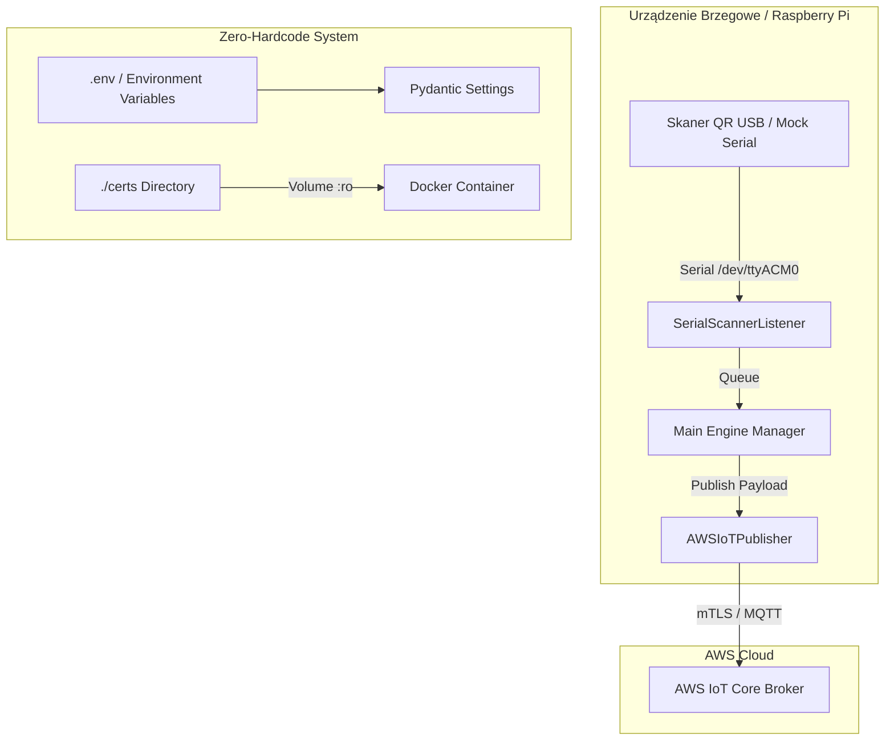

# Plan Działania: AWS IoT Edge QR Scanner Engine

Niniejszy dokument przedstawia szczegółowy plan wdrażania konteneryzowanej usługi czytnika kodów QR dla urządzeń Raspberry Pi połączonej z **AWS IoT Core**.

---

## 🏗️ Architektura Rozwiązania

---

## 📋 Fazowy Plan Realizacji

### Faza 1: Struktura Projektu & Konfiguracja ("Zero-Hardcode")
- [ ] Utworzenie struktury katalogów (`src/`, `tests/`, `certs/`, `docs/`).
- [ ] Przygotowanie plików zarządzania zależnościami: `requirements.txt` oraz `pyproject.toml` (`pyserial`, `awsiotsdk`, `pydantic-settings`, `pydantic`, `pytest`).
- [ ] Przygotowanie pliku wzorcowego `.env.example` ze wszystkimi zmiennymi z PRD oraz dodaną opcją `MOCK_SERIAL`.
- [ ] Stworzenie modułu `src/config.py` opartego o `pydantic-settings` do pełnej walidacji i serwowania konfiguracji w aplikacji.

### Faza 2: Obsługa Portu Szeregowego (`SerialScannerListener`)
- [ ] Stworzenie modułu `src/serial_listener.py`.
- [ ] Implementacja pętli nasłuchu na porcie z automatycznym czyszczeniem białych znaków (`\r`, `\n`) i dekodowaniem UTF-8.
- [ ] Obsługa mechanizmu **Auto-Reconnect** przy odłączeniu skanera USB (odporność na wyjście `SerialException`).
- [ ] Implementacja trybu symulacji `MOCK_SERIAL=true` pozwalającego na testowanie aplikacji bez podłączonego fizycznego skanera.

### Faza 3: Publikator AWS IoT Core (`AWSIoTPublisher`)
- [ ] Stworzenie modułu `src/aws_publisher.py`.
- [ ] Inicjalizacja połączenia mTLS z AWS IoT Core przy użyciu certyfikatów (`AWS_CERT_FILE`, `AWS_KEY_FILE`, `AWS_ROOT_CA_FILE`).
- [ ] Implementacja rekonnektów z **Exponential Backoff** w przypadku utraty połączenia internetowego.
- [ ] Formatowanie i walidacja ładunku wiadomości JSON (`event_id`, `client_id`, `timestamp`, `payload.raw_data`, `payload.encoding`).

### Faza 4: Główna Logika i Orkiestracja (`main.py`)
- [ ] Stworzenie punktu wejścia `src/main.py`.
- [ ] Spięcie listenera szeregowego z publikatorem MQTT za pomocą asynchronicznej kolejki w pamięci (`asyncio.Queue`).
- [ ] Obsługa sygnałów `SIGINT` oraz `SIGTERM` dla bezpiecznego wyłączania aplikacji (Graceful Shutdown).

### Faza 5: Konteneryzacja (Docker & Docker Compose)
- [ ] Utworzenie pliku `Dockerfile` na bazie `python:3.11-slim`.
- [ ] Utworzenie pliku `docker-compose.yml` z przekazywaniem urządzeń szeregowych oraz wolumenu certyfikatów w trybie read-only (`:ro`).
- [ ] Utworzenie `.dockerignore`.

### Faza 6: Testowanie i Weryfikacja
- [ ] Napisanie testów jednostkowych w `tests/` dla walidatora konfiguracji oraz tworzenia pakietów JSON.
- [ ] Weryfikacja działania w trybie mock na lokalnym środowisku.
- [ ] Dokumentacja uruchomieniowa w `README.md`.

---

## 🎯 Kryteria Akceptacji (Dostarczany Efekt)
1. **Cold Start**: Czysty start aplikacji, wczytanie `.env`, nawiązanie połączenia mTLS.
2. **Scan Event**: Poprawne uformowanie i wysłanie wiadomości MQTT.
3. **Resilience**: Automatyczne powracanie do pracy po ponownym podpięciu kabla USB lub odzyskaniu sieci.
4. **Zero-Hardcode**: Praca wyłącznie w oparciu o parametry środowiskowe.
